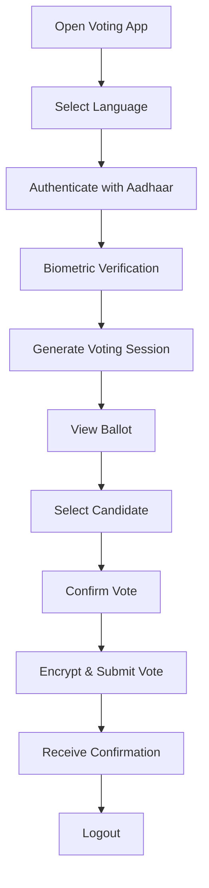
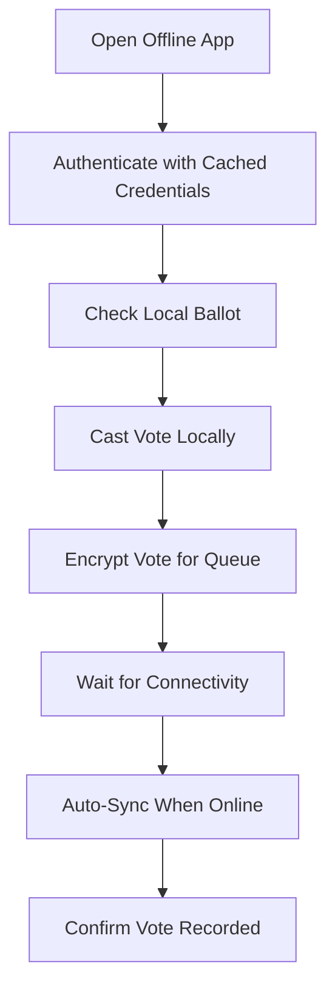
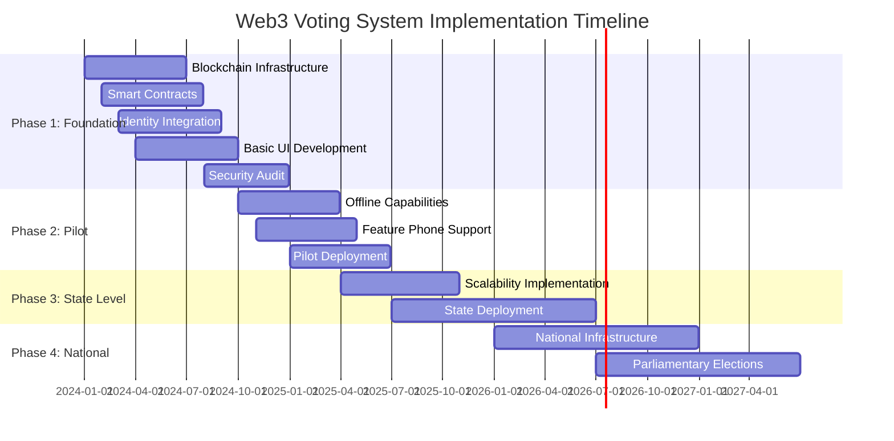

# Web3-Based National Voting System for India: Comprehensive Design Document

## Executive Summary

This document outlines the design for a Web3-based national voting system for India that replicates all features of offline voting while addressing the unique challenges of India's diverse population, connectivity constraints, and electoral requirements. The system leverages blockchain technology, digital identity infrastructure, and hybrid online-offline mechanisms to ensure secure, transparent, and inclusive democratic participation.

## Table of Contents

1. [Requirements Analysis](#requirements-analysis)
2. [High-Level Architecture](#high-level-architecture)
3. [Technology Stack](#technology-stack)
4. [Security Framework](#security-framework)
5. [User Experience Design](#user-experience-design)
6. [Offline Accessibility Solutions](#offline-accessibility-solutions)
7. [Legal Compliance & Governance](#legal-compliance--governance)
8. [Scalability Design](#scalability-design)
9. [Implementation Roadmap](#implementation-roadmap)
10. [Risk Assessment & Mitigation](#risk-assessment--mitigation)

## Requirements Analysis

### Functional Requirements

1. **Voter Authentication**: Secure identity verification using Aadhaar-based digital identity
2. **Vote Casting**: Intuitive interface supporting multiple languages and accessibility needs
3. **Vote Recording**: Immutable, encrypted storage on blockchain with audit trails
4. **Vote Counting**: Automated tallying with end-to-end verifiability
5. **Offline Operation**: Capability to function without internet connectivity
6. **Result Verification**: Public verifiability while maintaining voter anonymity
7. **Multi-Modal Access**: Support for smartphones, feature phones, and specialized kiosks

### Non-Functional Requirements

1. **Scalability**: Support for 900+ million eligible voters
2. **Performance**: Handle 100M+ concurrent votes during peak hours
3. **Availability**: 99.9% uptime during election periods
4. **Security**: End-to-end encryption, quantum-resistant cryptography
5. **Usability**: Accessible to users with varying literacy and technical skills
6. **Compliance**: Adherence to Indian electoral laws and data protection regulations

### Constraints

1. **Connectivity**: 25,000+ villages lack reliable internet
2. **Digital Divide**: 450 million feature phone users
3. **Languages**: Support for 22 official languages + regional dialects
4. **Rural Infrastructure**: Limited power supply and technical support
5. **Legal Framework**: Current laws require physical ballot secrecy

## High-Level Architecture

### System Components

```
┌─────────────────────────────────────────────────────────────────┐
│                    Web3 Voting System Architecture              │
├─────────────────────────────────────────────────────────────────┤
│                                                                 │
│  ┌─────────────────┐  ┌─────────────────┐  ┌─────────────────┐  │
│  │   Voter Layer   │  │   Access Layer  │  │  Identity Layer │  │
│  │                 │  │                 │  │                 │  │
│  │ • Mobile Apps   │  │ • API Gateway   │  │ • Aadhaar Auth  │  │
│  │ • Web Portal    │  │ • Load Balancer │  │ • Digital Certs │  │
│  │ • USSD/SMS      │  │ • Rate Limiting │  │ • Zero-Knowledge│  │
│  │ • Voice Interface│  │ • Security      │  │   Proofs        │  │
│  │ • Kiosk Systems │  │   Filters       │  │                 │  │
│  └─────────────────┘  └─────────────────┘  └─────────────────┘  │
│           │                     │                     │         │
│           └─────────────────────┼─────────────────────┘         │
│                                 │                               │
│  ┌─────────────────────────────────────────────────────────────┐  │
│  │                    Core Blockchain Layer                    │  │
│  │                                                             │  │
│  │  ┌─────────────┐  ┌─────────────┐  ┌─────────────────────┐  │  │
│  │  │ Consensus   │  │ Smart       │  │ State Management    │  │  │
│  │  │ Layer       │  │ Contracts   │  │                     │  │  │
│  │  │             │  │             │  │ • Vote Storage      │  │  │
│  │  │ • PoA-PoS   │  │ • Voting    │  │ • Candidate Mgmt    │  │  │
│  │  │   Hybrid    │  │ • Identity  │  │ • Election Config   │  │  │
│  │  │ • Validator │  │ • Audit     │  │ • Result Tallying   │  │  │
│  │  │   Nodes     │  │ • Privacy   │  │                     │  │  │
│  │  │             │  │             │  │                     │  │  │
│  │  └─────────────┘  └─────────────┘  └─────────────────────┘  │  │
│  └─────────────────────────────────────────────────────────────┘  │
│                                 │                               │
│  ┌─────────────────────────────────────────────────────────────┐  │
│  │                     Offline Layer                          │  │
│  │                                                             │  │
│  │  ┌─────────────┐  ┌─────────────┐  ┌─────────────────────┐  │  │
│  │  │ Mesh        │  │ SMS/USSD    │  │ Local Storage       │  │  │
│  │  │ Network     │  │ Gateway     │  │                     │  │  │
│  │  │             │  │             │  │ • Encrypted Votes   │  │  │
│  │  │ • Bluetooth │  │ • Feature   │  │ • Sync Queue        │  │  │
│  │  │ • WiFi-Direct│  │   Phone     │  │ • Offline Validation│  │  │
│  │  │ • NFC       │  │   Support   │  │ • Conflict Resolution│ │  │
│  │  │             │  │             │  │                     │  │  │
│  │  └─────────────┘  └─────────────┘  └─────────────────────┘  │  │
│  └─────────────────────────────────────────────────────────────┘  │
│                                                                 │
│  ┌─────────────────────────────────────────────────────────────┐  │
│  │                    Infrastructure Layer                     │  │
│  │                                                             │  │
│  │  ┌─────────────┐  ┌─────────────┐  ┌─────────────────────┐  │  │
│  │  │ Cloud       │  │ Edge        │  │ Monitoring &        │  │  │
│  │  │ Infrastructure│ │ Computing   │  │ Security            │  │  │
│  │  │             │  │             │  │                     │  │  │
│  │  │ • Multi-Cloud│  │ • District  │  │ • Real-time         │  │  │
│  │  │ • Auto-Scale │  │   Nodes     │  │   Analytics         │  │  │
│  │  │ • Disaster   │  │ • Local     │  │ • Threat Detection  │  │  │
│  │  │   Recovery   │  │   Caching   │  │ • Audit Logs        │  │  │
│  │  │             │  │             │  │                     │  │  │
│  │  └─────────────┘  └─────────────┘  └─────────────────────┘  │  │
│  └─────────────────────────────────────────────────────────────┘  │
└─────────────────────────────────────────────────────────────────┘
```

### Network Topology

1. **Central Blockchain Network**: Main chain hosted across multiple data centers
2. **State-Level Nodes**: Regional validation nodes in each state capital
3. **District Edge Nodes**: Local processing and caching infrastructure
4. **Polling Station Kiosks**: Offline-capable voting terminals
5. **Mobile Mesh Networks**: Device-to-device connectivity for rural areas

## Technology Stack

### Blockchain Platform

**Primary Choice: Hyperledger Fabric + Ethereum Hybrid**

**Rationale:**
- **Hyperledger Fabric**: Enterprise-grade permissioned blockchain for core voting infrastructure
- **Ethereum Layer 2**: Public verifiability and transparency layer
- **Hybrid Approach**: Best of both worlds - security and transparency

**Technical Specifications:**
```yaml
Consensus Mechanism: 
  - Primary: Practical Byzantine Fault Tolerance (PBFT)
  - Secondary: Proof of Authority (PoA) with elected validators
  
Block Time: 2-3 seconds
Transaction Throughput: 10,000+ TPS
Finality: Instant with PBFT

Smart Contract Languages:
  - Chaincode: Go, JavaScript (Hyperledger Fabric)
  - Solidity: Ethereum compatibility layer
  - Move: Future migration path to more secure contract language
```

### Digital Identity System

**Primary: Aadhaar-Based Zero-Knowledge Authentication**

```javascript
// Identity Authentication Flow
class VoterIdentity {
  constructor(aadhaarNumber, biometricData) {
    this.aadhaarHash = hash(aadhaarNumber);
    this.biometricProof = generateZKProof(biometricData);
    this.votingCredential = deriveCredential(this.aadhaarHash);
  }
  
  authenticate() {
    return verifyZKProof(this.biometricProof) && 
           verifyAadhaarBinding(this.aadhaarHash);
  }
  
  generateVotingToken() {
    return {
      voterToken: anonymizeCredential(this.votingCredential),
      sessionKey: generateEphemeralKey(),
      expiryTime: Date.now() + (24 * 60 * 60 * 1000) // 24 hours
    };
  }
}
```

### Cryptographic Protocols

**1. Post-Quantum Cryptography**
- **Key Exchange**: CRYSTALS-Kyber (NIST standardized)
- **Digital Signatures**: CRYSTALS-Dilithium + SPHINCS+
- **Hash Functions**: SHA-3, BLAKE3

**2. Privacy Protocols**
- **Zero-Knowledge Proofs**: zk-SNARKs for voter eligibility
- **Homomorphic Encryption**: Vote aggregation without decryption
- **Ring Signatures**: Anonymous vote casting

**3. Vote Encryption Scheme**
```solidity
pragma solidity ^0.8.0;

contract VotingCrypto {
    struct EncryptedVote {
        bytes32 candidateCommitment;  // Pedersen commitment
        bytes32[] zkProof;           // Zero-knowledge proof of validity
        bytes encryptedBallot;       // Homomorphically encrypted vote
        uint256 nullifierHash;       // Prevents double voting
    }
    
    struct ElectionKey {
        bytes32 publicKey;           // Election authority public key
        bytes32[] validators;        // Multi-sig threshold keys
        uint256 threshold;           // Required signatures for decryption
    }
    
    function castVote(
        EncryptedVote memory vote,
        bytes32 voterNullifier
    ) external {
        require(!nullifiers[voterNullifier], "Double voting detected");
        require(verifyZKProof(vote.zkProof), "Invalid vote proof");
        
        votes[currentElection].push(vote);
        nullifiers[voterNullifier] = true;
        
        emit VoteCast(voterNullifier, vote.candidateCommitment);
    }
}
```

## Security Framework

### Multi-Layer Security Architecture

**1. Infrastructure Security**
- **Network Isolation**: Separate networks for different components
- **Hardware Security Modules (HSMs)**: Key storage and cryptographic operations
- **Secure Boot**: Tamper-resistant device initialization
- **Hardware Attestation**: Device integrity verification

**2. Application Security**
- **Secure Coding Practices**: OWASP Top 10 compliance
- **Static Analysis**: Automated code vulnerability scanning
- **Runtime Protection**: Application-level firewalls
- **Input Validation**: Comprehensive sanitization

**3. Blockchain Security**
- **Validator Authentication**: Multi-factor authentication for nodes
- **Network Monitoring**: Real-time threat detection
- **Smart Contract Auditing**: Formal verification methods
- **Consensus Monitoring**: Byzantine fault detection

### Threat Model & Mitigation

**High-Priority Threats:**

1. **Nation-State Attacks**
   - *Mitigation*: Distributed infrastructure, quantum-resistant crypto
   - *Detection*: Advanced persistent threat monitoring

2. **Vote Buying/Coercion**
   - *Mitigation*: Delayed vote commitment, re-voting capability
   - *Detection*: Pattern analysis, anomaly detection

3. **Large-Scale Infrastructure Compromise**
   - *Mitigation*: Multi-cloud deployment, offline fallback
   - *Recovery*: Disaster recovery protocols, backup chains

4. **Identity Fraud**
   - *Mitigation*: Biometric verification, behavioral analysis
   - *Detection*: Machine learning fraud detection

### Security Protocols

```python
class SecurityManager:
    def __init__(self):
        self.threat_detector = ThreatDetectionEngine()
        self.incident_response = IncidentResponseSystem()
        self.audit_logger = AuditLogger()
    
    def monitor_election_security(self, election_id):
        """Continuous security monitoring during elections"""
        while election_active(election_id):
            # Network monitoring
            network_threats = self.threat_detector.scan_network()
            
            # Blockchain monitoring
            chain_anomalies = self.threat_detector.analyze_blockchain()
            
            # Voting pattern analysis
            voting_anomalies = self.threat_detector.analyze_voting_patterns()
            
            if any([network_threats, chain_anomalies, voting_anomalies]):
                self.incident_response.trigger_alert()
                
            time.sleep(5)  # Monitor every 5 seconds
    
    def validate_vote_integrity(self, vote_data):
        """Multi-layer vote validation"""
        checks = [
            self.verify_cryptographic_signature(vote_data),
            self.verify_voter_eligibility(vote_data),
            self.verify_temporal_constraints(vote_data),
            self.verify_geographical_constraints(vote_data)
        ]
        
        return all(checks)
```

## User Experience Design

### Multi-Modal Interface Support

**1. Smartphone Application**
```typescript
interface VotingApp {
  // Progressive Web App with offline capability
  authentication: {
    aadhaar: AadhaarAuth;
    biometric: BiometricAuth;
    otp: OTPAuth;
  };
  
  accessibility: {
    screenReader: boolean;
    largeText: boolean;
    voiceAssistance: boolean;
    gestureNavigation: boolean;
  };
  
  languages: SupportedLanguage[];
  offlineMode: OfflineCapability;
}

class VotingInterface {
  renderBallot(election: Election, userPrefs: UserPreferences) {
    return {
      candidates: this.displayCandidates(election.candidates),
      accessibility: this.applyAccessibilitySettings(userPrefs),
      language: this.setLanguage(userPrefs.language),
      layout: this.adaptToDevice(userPrefs.device)
    };
  }
}
```

**2. Feature Phone (USSD/SMS) Interface**
```
*123*VOTE# → Main Menu
1. Vote in Lok Sabha Election
2. Vote in State Election  
3. Check Voting Status
4. Help

Select Option: 1

Enter Aadhaar Last 4 digits: ****
Enter OTP: ******

Candidates:
1. Candidate A (Party X)
2. Candidate B (Party Y)
3. NOTA

Vote for: 1
Confirm (1=Yes, 2=No): 1

Vote recorded successfully!
SMS confirmation sent.
```

**3. Voice Interface (IVR)**
```python
class VoiceVotingSystem:
    def handle_call(self, phone_number):
        """Interactive Voice Response for voting"""
        
        # Language selection
        language = self.prompt_language_selection()
        
        # Authentication
        aadhaar_digits = self.prompt_aadhaar_digits(language)
        otp = self.send_and_verify_otp(phone_number)
        
        if self.authenticate(aadhaar_digits, otp):
            # Present ballot
            ballot = self.get_ballot_for_constituency(phone_number)
            choice = self.present_candidates_audio(ballot, language)
            
            # Confirm and record vote
            if self.confirm_vote(choice, language):
                self.record_vote(choice)
                self.play_confirmation_message(language)
```

### User Journey Flows

**Online Voting Flow:**


**Offline Voting Flow:**


## Offline Accessibility Solutions

### Technical Implementation

**1. Mesh Network Architecture**
```python
class MeshVotingNetwork:
    def __init__(self):
        self.nodes = []
        self.vote_queue = OfflineVoteQueue()
        self.sync_manager = SyncManager()
    
    def discover_peers(self):
        """Discover nearby voting devices"""
        peers = []
        
        # Bluetooth discovery
        bt_peers = self.bluetooth.discover_devices()
        
        # WiFi Direct discovery  
        wifi_peers = self.wifi_direct.discover_peers()
        
        # NFC proximity
        nfc_peers = self.nfc.detect_nearby_devices()
        
        return peers
    
    def propagate_vote(self, encrypted_vote):
        """Propagate vote through mesh network"""
        peers = self.discover_peers()
        
        for peer in peers:
            if peer.has_connectivity():
                peer.relay_vote(encrypted_vote)
                break
    
    def sync_offline_votes(self):
        """Sync votes when connectivity restored"""
        if self.has_internet_connection():
            while not self.vote_queue.empty():
                vote = self.vote_queue.pop()
                success = self.submit_to_blockchain(vote)
                
                if not success:
                    self.vote_queue.push(vote)  # Retry later
                    break
```

**2. SMS-Based Voting Protocol**
```python
class SMSVotingGateway:
    def __init__(self):
        self.encryption = SMSEncryption()
        self.validation = VoteValidation()
    
    def process_sms_vote(self, sender, message):
        """Process vote received via SMS"""
        
        try:
            # Decrypt and parse vote
            vote_data = self.encryption.decrypt_sms(message)
            
            # Validate vote structure
            if not self.validation.validate_format(vote_data):
                self.send_error_sms(sender, "Invalid vote format")
                return
            
            # Authenticate voter
            if not self.authenticate_sms_voter(sender, vote_data):
                self.send_error_sms(sender, "Authentication failed")
                return
            
            # Queue vote for blockchain submission
            self.queue_vote_for_blockchain(vote_data)
            
            # Send confirmation
            self.send_confirmation_sms(sender, vote_data['vote_id'])
            
        except Exception as e:
            self.send_error_sms(sender, "Vote processing failed")
            self.log_error(sender, str(e))
    
    def send_confirmation_sms(self, phone, vote_id):
        message = f"Vote recorded. ID: {vote_id[:8]}. Track status: *123*STATUS#{vote_id}"
        self.sms_service.send(phone, message)
```

**3. Offline Storage & Synchronization**
```typescript
class OfflineVotingStore {
  private db: IndexedDB;
  private encryption: CryptoService;
  
  async storeOfflineVote(vote: Vote): Promise<string> {
    const encrypted = await this.encryption.encrypt(vote);
    const voteId = generateUUID();
    
    await this.db.transaction('votes', 'readwrite')
      .objectStore('votes')
      .add({
        id: voteId,
        encrypted_data: encrypted,
        timestamp: Date.now(),
        synced: false
      });
    
    return voteId;
  }
  
  async syncPendingVotes(): Promise<void> {
    const pendingVotes = await this.getPendingVotes();
    
    for (const vote of pendingVotes) {
      try {
        const success = await this.submitToBlockchain(vote);
        
        if (success) {
          await this.markAsSynced(vote.id);
        }
      } catch (error) {
        console.error('Sync failed for vote:', vote.id, error);
      }
    }
  }
  
  private async getPendingVotes(): Promise<OfflineVote[]> {
    return this.db.transaction('votes', 'readonly')
      .objectStore('votes')
      .index('synced')
      .getAll(false);
  }
}
```

### Rural Infrastructure Considerations

**1. Power Management**
```python
class PowerOptimizedVoting:
    def __init__(self):
        self.battery_level = self.get_battery_level()
        self.power_mode = self.determine_power_mode()
    
    def optimize_for_battery(self):
        """Optimize app behavior based on battery level"""
        
        if self.battery_level < 20:
            # Ultra power saving mode
            self.disable_animations()
            self.reduce_screen_brightness()
            self.minimize_network_usage()
            self.compress_data_aggressively()
        
        elif self.battery_level < 50:
            # Moderate power saving
            self.reduce_background_sync()
            self.optimize_graphics()
            self.batch_network_requests()
    
    def solar_charging_awareness(self):
        """Adapt to solar charging patterns in rural areas"""
        current_hour = datetime.now().hour
        
        # Peak solar hours (10 AM - 4 PM)
        if 10 <= current_hour <= 16:
            self.enable_full_functionality()
            self.opportunistic_sync()
        else:
            self.enable_power_saving_mode()
```

**2. Connectivity Adaptation**
```python
class ConnectivityManager:
    def __init__(self):
        self.connection_type = self.detect_connection()
        self.bandwidth = self.measure_bandwidth()
        self.latency = self.measure_latency()
    
    def adapt_to_connection(self):
        """Adapt app behavior to connection quality"""
        
        if self.connection_type == '2G':
            # Ultra-low bandwidth mode
            self.enable_text_only_mode()
            self.compress_all_data()
            self.use_sms_fallback()
        
        elif self.connection_type == '3G':
            # Limited bandwidth mode
            self.reduce_image_quality()
            self.enable_compression()
            self.batch_requests()
        
        elif self.bandwidth < 1_000_000:  # < 1 Mbps
            # Slow connection mode
            self.enable_progressive_loading()
            self.cache_aggressively()
```

## Legal Compliance & Governance

### Indian Electoral Law Compliance

**1. Secret Ballot Requirements**
```python
class SecretBallotCompliance:
    def __init__(self):
        self.privacy_layer = AnonymizationLayer()
        self.audit_logger = AuditLogger()
    
    def ensure_vote_secrecy(self, vote_data):
        """Comply with secret ballot requirements"""
        
        # Separate voter identity from vote choice
        voter_token = self.anonymize_voter_identity(vote_data.voter_id)
        encrypted_choice = self.encrypt_vote_choice(vote_data.candidate)
        
        # Create unlinkable vote record
        vote_record = {
            'vote_id': generate_uuid(),
            'timestamp': vote_data.timestamp,
            'constituency': vote_data.constituency,
            'encrypted_choice': encrypted_choice,
            'zero_knowledge_proof': self.generate_validity_proof(vote_data)
        }
        
        # Log for audit (without vote choice)
        self.audit_logger.log_vote_cast(voter_token, vote_record.vote_id)
        
        return vote_record
    
    def verify_no_vote_buying(self, voting_pattern):
        """Detect potential vote buying patterns"""
        
        # Analyze temporal patterns
        if self.detect_coordinated_voting(voting_pattern):
            self.flag_for_investigation("Coordinated voting detected")
        
        # Analyze geographical clustering
        if self.detect_unusual_clustering(voting_pattern):
            self.flag_for_investigation("Unusual geographical clustering")
```

**2. Election Commission Integration**
```python
class ElectionCommissionInterface:
    def __init__(self):
        self.ec_api = ECIAPIClient()
        self.compliance_checker = ComplianceChecker()
    
    def register_election(self, election_config):
        """Register election with Election Commission"""
        
        # Validate compliance with ECI requirements
        compliance_report = self.compliance_checker.validate(election_config)
        
        if not compliance_report.is_compliant:
            raise ComplianceError(compliance_report.violations)
        
        # Submit to ECI for approval
        approval = self.ec_api.submit_election_proposal(election_config)
        
        return approval
    
    def generate_compliance_report(self, election_id):
        """Generate post-election compliance report"""
        
        report = {
            'election_id': election_id,
            'total_votes': self.get_total_vote_count(election_id),
            'vote_secrecy_maintained': self.verify_secrecy_compliance(election_id),
            'audit_trail_complete': self.verify_audit_completeness(election_id),
            'technical_issues': self.get_technical_issues(election_id),
            'security_incidents': self.get_security_incidents(election_id)
        }
        
        return self.ec_api.submit_compliance_report(report)
```

### Data Protection Compliance

**GDPR/Data Protection Act Compliance:**
```typescript
interface DataProtectionCompliance {
  personalDataHandling: {
    minimization: boolean;          // Collect only necessary data
    purposeLimitation: boolean;     // Use data only for voting
    storageMinimization: boolean;   // Delete after legal retention period
    consent: ConsentManagement;     // Explicit consent for processing
  };
  
  voterRights: {
    accessRight: boolean;           // Right to access vote status
    rectificationRight: boolean;    // Right to correct errors
    erasureRight: boolean;          // Right to deletion after election
    portabilityRight: boolean;      // Right to data portability
  };
  
  technicalMeasures: {
    encryptionAtRest: boolean;
    encryptionInTransit: boolean;
    accessControls: boolean;
    auditLogging: boolean;
  };
}
```

## Scalability Design

### Horizontal Scaling Architecture

**1. Sharded Blockchain Design**
```python
class ShardedVotingBlockchain:
    def __init__(self):
        self.shards = self.initialize_shards()
        self.cross_shard_coordinator = CrossShardCoordinator()
    
    def initialize_shards(self):
        """Initialize blockchain shards by state/region"""
        shards = {}
        
        for state in INDIAN_STATES:
            shard = BlockchainShard(
                shard_id=state.code,
                validators=self.get_state_validators(state),
                capacity=self.calculate_shard_capacity(state.population)
            )
            shards[state.code] = shard
        
        return shards
    
    def route_vote(self, vote_data):
        """Route vote to appropriate shard"""
        
        constituency = vote_data.constituency
        state_code = self.get_state_code(constituency)
        
        target_shard = self.shards[state_code]
        
        # Check shard capacity
        if target_shard.is_overloaded():
            # Use overflow shard or queue
            return self.handle_overflow(vote_data, state_code)
        
        return target_shard.process_vote(vote_data)
    
    def aggregate_results(self, election_id):
        """Aggregate results across all shards"""
        
        results = {}
        
        for shard_id, shard in self.shards.items():
            shard_results = shard.get_election_results(election_id)
            results[shard_id] = shard_results
        
        return self.cross_shard_coordinator.aggregate(results)
```

**2. Auto-Scaling Infrastructure**
```yaml
# Kubernetes deployment configuration
apiVersion: apps/v1
kind: Deployment
metadata:
  name: voting-blockchain-node
spec:
  replicas: 3
  selector:
    matchLabels:
      app: blockchain-node
  template:
    metadata:
      labels:
        app: blockchain-node
    spec:
      containers:
      - name: blockchain-node
        image: voting-system/blockchain-node:latest
        resources:
          requests:
            memory: "2Gi"
            cpu: "1"
          limits:
            memory: "8Gi"
            cpu: "4"
        env:
        - name: NODE_TYPE
          value: "validator"
        - name: SHARD_ID
          valueFrom:
            fieldRef:
              fieldPath: metadata.labels['shard-id']
---
apiVersion: autoscaling/v2
kind: HorizontalPodAutoscaler
metadata:
  name: blockchain-node-hpa
spec:
  scaleTargetRef:
    apiVersion: apps/v1
    kind: Deployment
    name: voting-blockchain-node
  minReplicas: 3
  maxReplicas: 50
  metrics:
  - type: Resource
    resource:
      name: cpu
      target:
        type: Utilization
        averageUtilization: 70
  - type: Resource
    resource:
      name: memory
      target:
        type: Utilization
        averageUtilization: 80
```

**3. Performance Optimization**
```python
class VotingSystemOptimizer:
    def __init__(self):
        self.cache_manager = CacheManager()
        self.load_balancer = LoadBalancer()
        self.performance_monitor = PerformanceMonitor()
    
    def optimize_for_peak_load(self, expected_concurrent_users):
        """Optimize system for peak voting periods"""
        
        # Pre-scale infrastructure
        required_nodes = self.calculate_required_nodes(expected_concurrent_users)
        self.auto_scaler.pre_scale(required_nodes)
        
        # Warm up caches
        self.cache_manager.pre_load_hot_data()
        
        # Optimize database connections
        self.db_pool.expand_to(required_nodes * 10)
        
        # Enable aggressive caching
        self.cache_manager.enable_aggressive_mode()
    
    def handle_traffic_spike(self, current_load):
        """Handle sudden traffic spikes"""
        
        if current_load > self.NORMAL_CAPACITY * 0.8:
            # Enable rate limiting
            self.rate_limiter.enable_adaptive_limiting()
            
            # Redirect to edge nodes
            self.load_balancer.enable_edge_routing()
            
            # Scale out immediately
            self.auto_scaler.emergency_scale_out()
            
            # Enable CDN for static assets
            self.cdn.enable_aggressive_caching()
```

## Implementation Roadmap

### Phase 1: Foundation (Months 1-12)

**Infrastructure Setup:**
- Deploy core blockchain network with 5 validator nodes
- Implement basic smart contracts for voting logic
- Develop Aadhaar integration for identity verification
- Create basic mobile and web applications

**Deliverables:**
- Proof-of-concept voting system
- Security audit report
- Basic user interface in 3 languages
- Integration with test Aadhaar sandbox

**Success Metrics:**
- 10,000 test votes processed
- < 3 second transaction confirmation
- 99.9% uptime during testing

### Phase 2: Pilot Testing (Months 13-18)

**Limited Deployment:**
- Deploy in 5 constituencies for local elections
- Implement offline voting capabilities
- Add support for feature phones (USSD/SMS)
- Comprehensive security testing

**Deliverables:**
- Production-ready system for limited deployment
- Offline voting functionality
- Multi-modal access interfaces
- Disaster recovery procedures

**Success Metrics:**
- 100,000 real votes cast successfully
- < 1% technical failure rate
- Positive user feedback (>80% satisfaction)

### Phase 3: State-Level Deployment (Months 19-30)

**Expanded Rollout:**
- Deploy across 3-5 states for state elections
- Implement full scalability features
- Add advanced security monitoring
- Complete accessibility features

**Deliverables:**
- State-level voting infrastructure
- Real-time monitoring and analytics
- Complete multi-language support
- Advanced fraud detection

**Success Metrics:**
- 10 million votes processed
- < 0.1% security incidents
- 95% voter accessibility compliance

### Phase 4: National Deployment (Months 31-42)

**Full-Scale Implementation:**
- National deployment for parliamentary elections
- Complete offline infrastructure
- Integration with all existing systems
- Continuous optimization

**Deliverables:**
- National voting infrastructure
- Complete offline fallback systems
- Integration with ECI systems
- Public verification tools

**Success Metrics:**
- 500+ million votes capability
- < 0.01% failure rate
- Full legal compliance

### Development Timeline



## Risk Assessment & Mitigation

### Technical Risks

| Risk Category | Probability | Impact | Mitigation Strategy |
|---------------|-------------|--------|-------------------|
| **Blockchain Scalability** | Medium | High | Sharding, Layer 2 solutions, hybrid architecture |
| **Quantum Computing Threat** | Low | Critical | Post-quantum cryptography implementation |
| **Network Partition** | Medium | High | Offline capabilities, mesh networking |
| **Smart Contract Bugs** | Medium | High | Formal verification, extensive testing, bug bounties |
| **Infrastructure Failure** | Low | High | Multi-cloud deployment, automated failover |

### Security Risks

| Risk Category | Probability | Impact | Mitigation Strategy |
|---------------|-------------|--------|-------------------|
| **Nation-State Attack** | Medium | Critical | Defense in depth, international cooperation |
| **Vote Buying** | High | High | Anonymous voting, temporal delays, pattern detection |
| **Identity Fraud** | Medium | High | Biometric verification, behavioral analysis |
| **Insider Threats** | Low | High | Zero-trust architecture, continuous monitoring |
| **DDoS Attacks** | High | Medium | CDN, auto-scaling, rate limiting |

### Legal/Regulatory Risks

| Risk Category | Probability | Impact | Mitigation Strategy |
|---------------|-------------|--------|-------------------|
| **Regulatory Changes** | Medium | High | Flexible architecture, compliance monitoring |
| **Legal Challenges** | High | Medium | Stakeholder engagement, transparency |
| **International Disputes** | Low | Medium | Diplomatic engagement, transparency |
| **Privacy Violations** | Low | High | Privacy by design, regular audits |

### Operational Risks

| Risk Category | Probability | Impact | Mitigation Strategy |
|---------------|-------------|--------|-------------------|
| **Staff Shortage** | Medium | Medium | Training programs, knowledge documentation |
| **Vendor Lock-in** | Low | Medium | Open source components, multi-vendor strategy |
| **Budget Overruns** | Medium | High | Phased implementation, regular reviews |
| **Timeline Delays** | High | Medium | Agile development, parallel workstreams |

## Conclusion

This comprehensive design for a Web3-based national voting system for India addresses the unique challenges of the world's largest democracy while incorporating lessons learned from successful implementations like Estonia's e-voting system and India's own blockchain pilots.

### Key Innovations

1. **Hybrid Online-Offline Architecture**: Ensures accessibility even in areas with poor connectivity
2. **Multi-Modal Access**: Supports smartphones, feature phones, and voice interfaces
3. **Post-Quantum Security**: Future-proof cryptographic protection
4. **Aadhaar Integration**: Leverages existing digital identity infrastructure
5. **Scalable Blockchain Design**: Sharded architecture for massive throughput
6. **Legal Compliance**: Built-in compliance with Indian electoral laws

### Success Factors

- **Gradual Rollout**: Phased implementation reduces risk and builds confidence
- **Stakeholder Engagement**: Early involvement of Election Commission, civil society, and voters
- **Transparency**: Open-source components and public verifiability
- **Accessibility**: Universal design principles for inclusive participation
- **Security**: Defense-in-depth approach with continuous monitoring

This system has the potential to modernize India's electoral process while maintaining the integrity, secrecy, and accessibility that are fundamental to democratic participation. The phased implementation approach allows for learning and adaptation while building public trust in this transformative technology.

---

*This document serves as a comprehensive blueprint for implementing a Web3-based voting system in India. Regular updates and refinements should be made based on stakeholder feedback, technological advances, and pilot program results.*